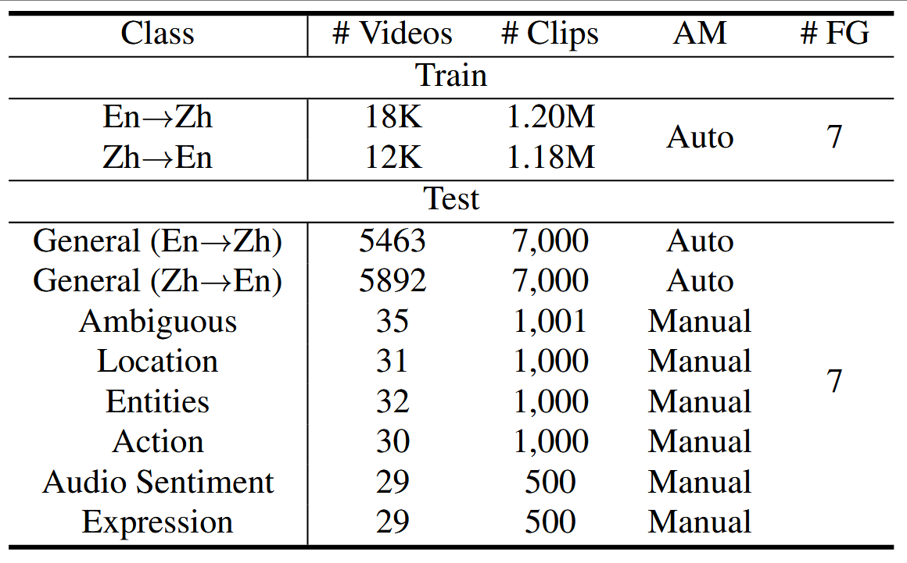
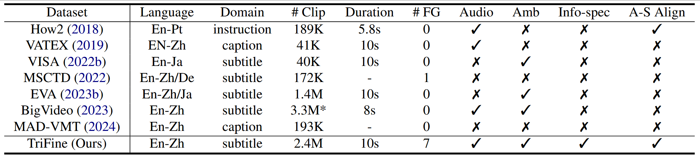
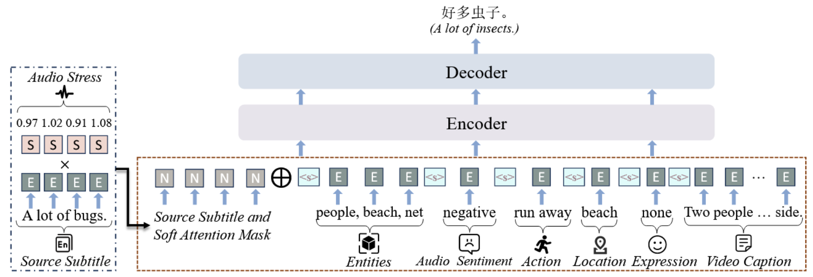
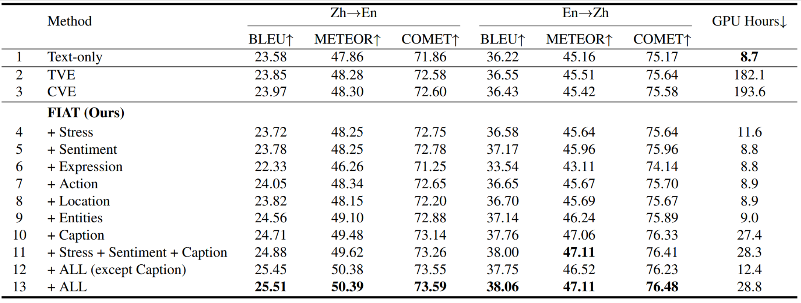

# Abstract 

Current video-guided machine translation (VMT) approaches primarily use coarsegrained visual information, resulting in information redundancy, high computational overhead, and neglect of audio content. Our research demonstrates the significance of finegrained visual and audio information in VMT from both data and methodological perspectives. From the data perspective, we have developed a large-scale dataset TriFine, the first vision-audio-subtitle tri-modal VMT dataset with annotated multimodal fine-grained tags. Each entry in this dataset not only includes the triples found in traditional VMT datasets but also encompasses seven fine-grained annotation tags derived from visual and audio modalities. From the methodological perspective, we propose a Fine-grained Information-enhanced Approach for Translation (FIAT). Experimental results have shown that, in comparison to traditional coarse-grained methods and text-only models, our fine-grained approach achieves superior performance with lower computational overhead. These findings underscore the pivotal role of fine-grained annotated information in advancing the field of VMT.

# TriFine

<!--  -->

<figure style="display: table; margin: auto;">
  
  <figcaption style="text-align: center; font-size: 0.9em; color: gray;">The Construction Process of TriFine</figcaption>
</figure>

 

<figure style="display: table; margin: auto;">
  
  <figcaption style="text-align: center; font-size: 0.9em; color: gray;">Statistics of the TriFine Dataset</figcaption>
</figure>

 

<figure style="display: table; margin: auto;">
  
  <figcaption style="text-align: center; font-size: 0.9em; color: gray;">Statistical comparison between the TriFine dataset and other VMT datasets. “# FG” denotes the number of fine-grained tag types. “Amb” and “Info-spec” refer to the ambiguity and information-specific test sets, respectively. “A-S Align” indicates whether audio-subtitle alignment is provided.
Note: Although BigVideo initially reported 4.5 million clips, only 3.3 million are publicly available due to privacy restrictions.</figcaption>
</figure>

# FIAT

<figure style="display: table; margin: auto;">
  
  <figcaption style="text-align: center; font-size: 0.9em; color: gray;">FIAT framework architecture</figcaption>
</figure>

 

<figure style="display: table; margin: auto;">
  
  <figcaption style="text-align: center; font-size: 0.9em; color: gray;">Main Experimental Results of the FIAT Method</figcaption>
</figure>

<!-- <figure style="text-align:center;">
  
  <figcaption style="text-align:center; font-size: 0.9em; color: gray;">Statistical comparison between the TriFine dataset and other VMT datasets. “# FG” denotes the number of fine-grained tag types. “Amb” and “Info-spec” refer to the ambiguity and information-specific test sets, respectively. “A-S Align” indicates whether audio-subtitle alignment is provided.
Note: Although BigVideo initially reported 4.5 million clips, only 3.3 million are publicly available due to privacy restrictions.</figcaption>
</figure> -->

<!-- 

<figcaption style="font-size: 0.9em; color: gray;">图 1：这是图片的说明文字</figcaption>

 -->

