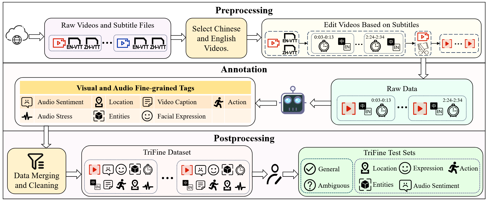
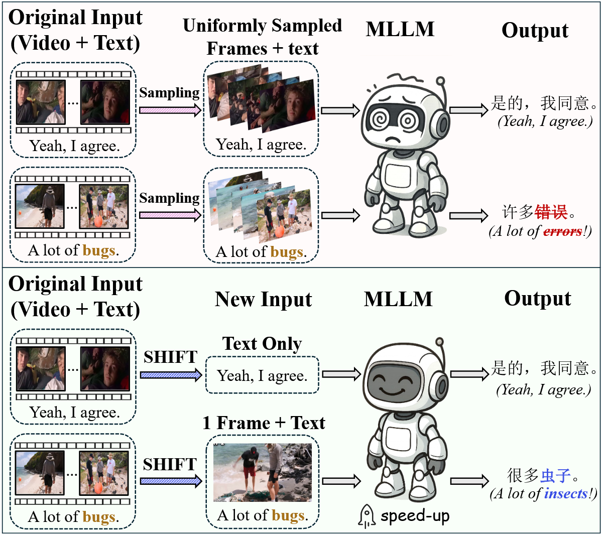
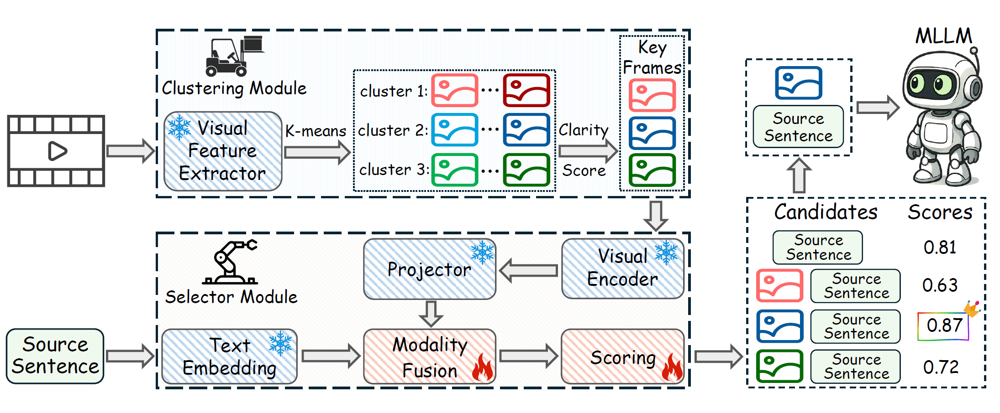
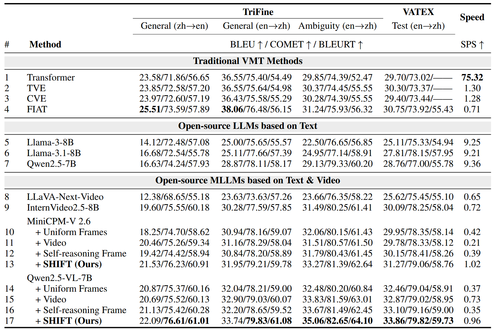
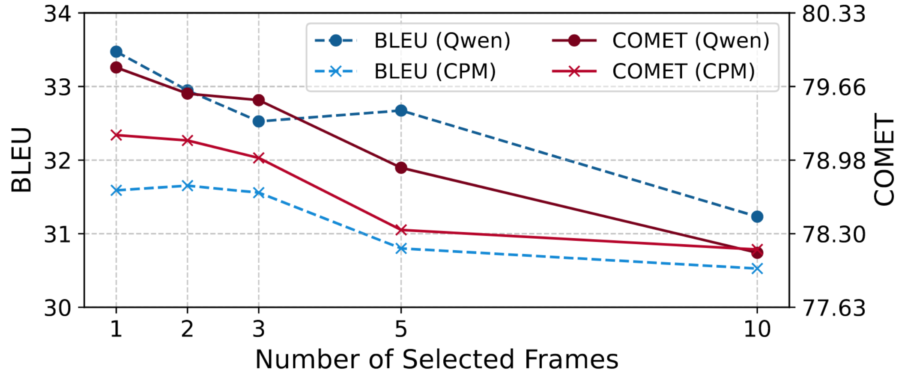

# Abstract 

Video-guided Machine Translation (VMT) aims to improve translation quality by integrating contextual information from paired short video clips. Mainstream VMT approaches typically incorporate multimodal information by uniformly sampling frames from the input videos. However, this paradigm frequently incurs significant computational overhead and introduces redundant multimodal content, which degrades both efficiency and translation quality. To tackle these challenges, we propose SHIFT (Selected Helpful Informative Frame for Translation). It is a lightweight, plug-and-play framework designed for VMT with Multimodal Large Language Models (MLLMs). SHIFT adaptively selects a single informative key frame when visual context is necessary; otherwise, it relies solely on textual input. This process is guided by a dedicated clustering module and a selector module. Experimental results demonstrate that SHIFT enhances the performance of MLLMs on the VMT task while simultaneously reducing computational cost, without sacrificing generalization ability. The code will be released upon acceptance.

# SHIFT

<!--  --> 

 
 

<figure style="display: table; margin: auto;">
  
  <figcaption style="text-align: center; font-size: 0.9em; color: gray;">Comparison of the conventional VMT paradigm (top) and our SHIFT framework (bottom). The conventional VMT paradigm translates the subtitle  text by jointly processing uniformly sampled frames. In contrast, SHIFT employs text-only inputs for simple  cases and selects one key video frame when visual context is required (e.g., ambiguous word “bug”). Blue/red indicate correct/incorrect translations.</figcaption>
</figure>

 

<figure style="display: table; margin: auto;">
  
  <figcaption style="text-align: center; font-size: 0.9em; color: gray;">Overview of the SHIFT framework, consisting of a clustering module and a selector module. The  clustering module groups frames into K clusters (e.g., K=3 in the figure) based on visual features, and selects the  clearest frame from each cluster as a key frame. The selector module scores K key frame–text pairs and a text-only  input; the top-scoring input is used for inference. Only the modality fusion layer and scoring head is trainable  (indicated by flame), while all other components remain frozen (denoted by snowflake).</figcaption>
</figure>

 

<figure style="display: table; margin: auto;">
  
  <figcaption style="text-align: center; font-size: 0.9em; color: gray;">Results of methods on the TriFine en-zh general test sets, the ambiguity test set, and VATEX test set,  averaged over three random seeds. SPS (Samples Per Second) denotes the average inference speed. The best value  for each metric on each test set is highlighted in bold.</figcaption>
</figure>

 

<!-- # FIAT -->

<figure style="display: table; margin: auto;">
  
  <figcaption style="text-align: center; font-size: 0.9em; color: gray;">BLEU and COMET scores of Qwen2.5-VL7B and MiniCPM-V2.6 with different frame counts on  the TriFine en→zh general test set.</figcaption>
</figure>

 

