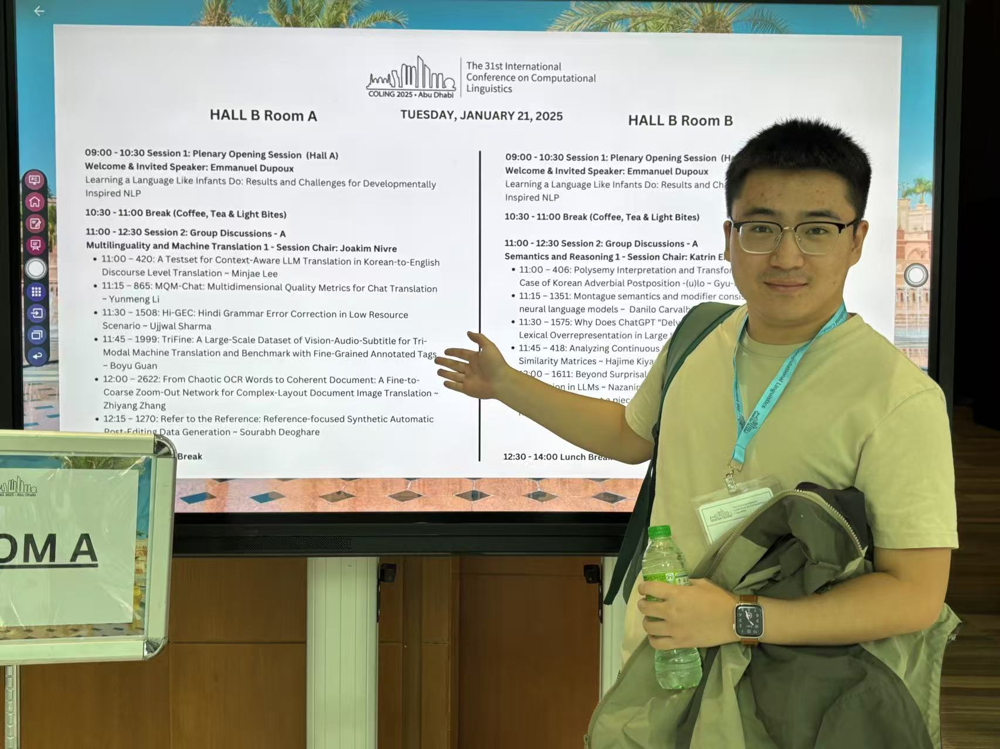
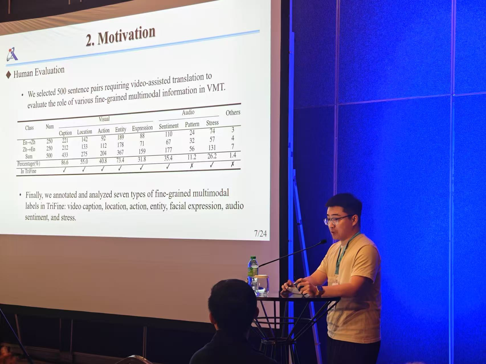
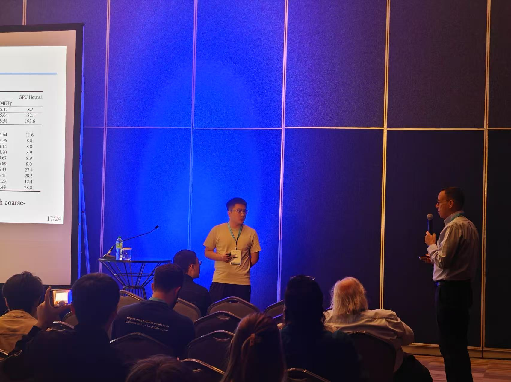

  My paper, <strong><a href="../publication/2025-01-TriFine">"TriFine: A Large-Scale Dataset of Vision-Audio-Subtitle for Tri-Modal Machine Translation and Benchmark with Fine-Grained Annotated Tags"</a></strong>, was accepted as an <strong>Oral presentation</strong> in the <em>Machine Translation</em> track at <strong>COLING 2025</strong>. I presented it on <strong>January 21, 2025</strong>, at the <strong>ADNEC Centre Abu Dhabi</strong>, United Arab Emirates.

  Below are some photos from the event. 
  You can <a href="../files/paper-TriFine/oral-TriFine.pdf" download><strong>click here</strong></a> to download the slides from my talk.

<figure style="display: table; margin: auto;">
  
  <figcaption style="text-align: center; font-size: 0.9em; color: gray;">Presenting at COLING 2025 (1)</figcaption>
</figure>

 

<figure style="display: table; margin: auto;">
  
  <figcaption style="text-align: center; font-size: 0.9em; color: gray;">Presenting at COLING 2025 (2)</figcaption>
</figure>

 

<figure style="display: table; margin: auto;">
  
  <figcaption style="text-align: center; font-size: 0.9em; color: gray;">Presenting at COLING 2025 (3)</figcaption>
</figure>

<!-- My paper, **"TriFine: A Large-Scale Dataset of Vision-Audio-Subtitle for Tri-Modal Machine Translation and Benchmark with Fine-Grained Annotated Tags,"** was accepted as an **Oral presentation** in the *Machine Translation* track at **COLING 2025**. I presented it on **January 21, 2025**, at the **ADNEC Centre Abu Dhabi**, United Arab Emirates.

Below are some photos from the event.
You can \[**click here**] to download the slides from my talk. -->